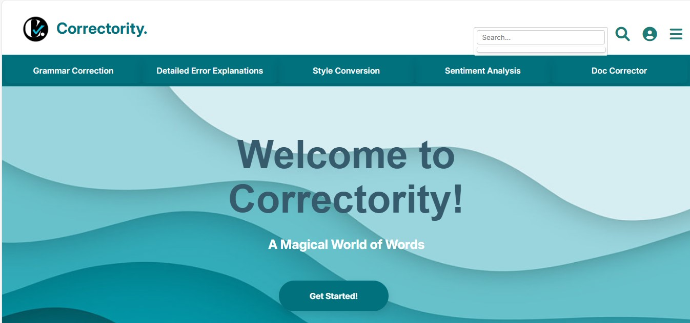
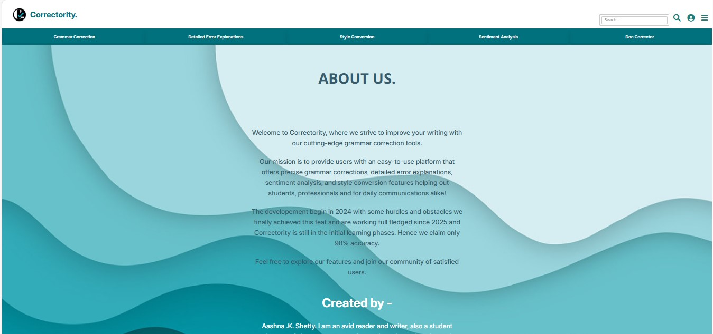
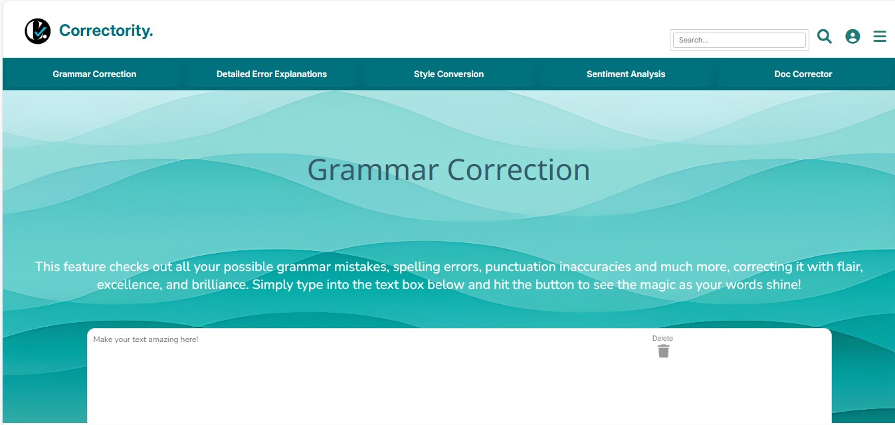
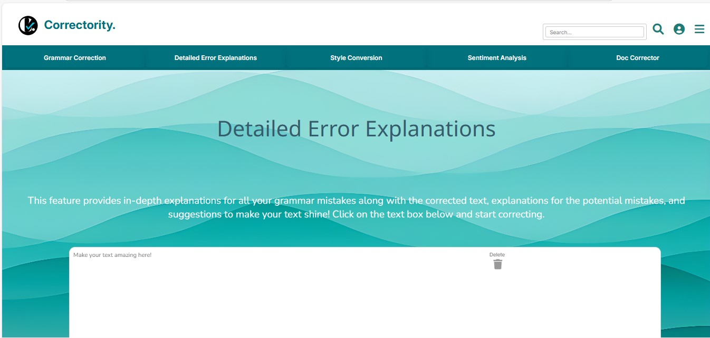
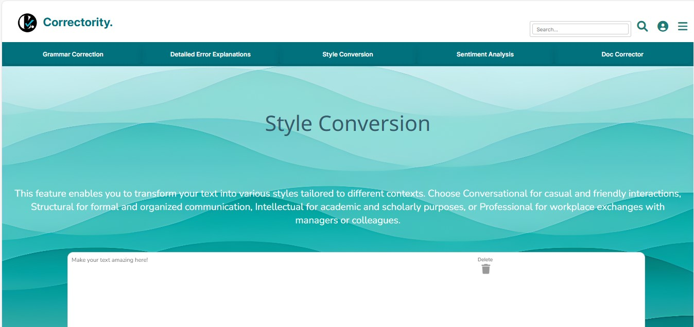
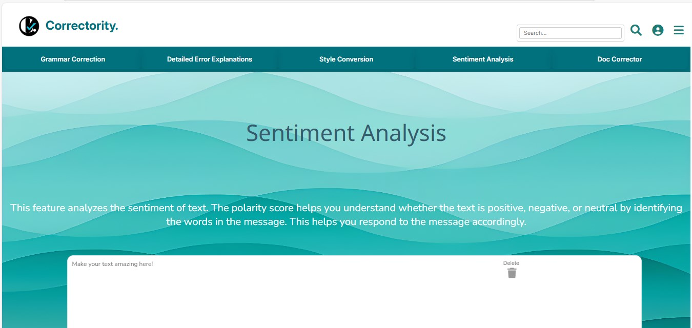
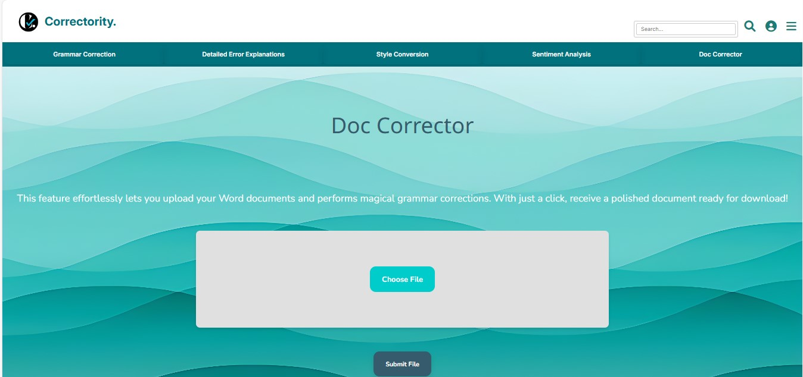

## Correctority: Your Guardian for Correctness

**Project Duration:** 31st August 2024 - 11th April 2025
  

## **Description**

- Correctority is an advanced grammar correction and writing assistant app that empowers users to write with confidence.
- It provides grammar corrections, detailed explanations, style improvements, sentiment analysis, and a document corrector feature. 
  

## **Table of Contents**
## **1. About the Project**
Correctority is an amalgamation of two words: Correction and Authority. This app helps users correct grammar and style, with features that range from grammar correction and tone analysis to document correction and writing suggestions. It’s designed for writers, students, professionals, and anyone who values polished and effective communication.
  

## **2. Features**

- **1. Grammar Correction**
Detects and corrects grammar issues, from spelling mistakes, grammatical errors and even punctuation marks providing detailed explanations for each correction.

- **2. Detailed Error Explanations**
Provides in-depth explanations on your grammar errors, from spellings, sentences to tenses by correcting it and giving the reason for correction and also providing multiple suggestions so that you can choose what fits the best.

- **3. Style Conversion**
Suggests ways to improve the structure, tone, and professionalism of the text by providing options from:
i. Structural : Strcutes the sentence on a formal context.
ii. Conversational : Structures the sentences based on informal and conversational context.
iii. Professional : Adapts to a more professional conversation style for offices and businesses.
iv. Academic : Pertains to the academic writing style highly suitable for students.

-  **4. Sentiment Analysis**
Analyzes the tone of your text, which is especially helpful for reviews or feedback providing the polarity scores in return. The polarity score is determined between Positive, Negative and Neutral.

-  **5. Doc Corrector**
Finds and corrects errors grammar issues in entire documents and allows downloading of the corrected version.
   

## **3. Technologies Used**
- Frontend: HTML, CSS, JavaScript
- Backend: Python, Streamlit
- APIs: LanguageTool API, Mammoth.js for document processing
- Deployment: GitHub Pages
 

**API**

- Language Tool API - A free API was used to detect the grammar issues and mistakes.
  

## **4. Some amazing features**

- Logo is clickable leading back to home page.  
- Favicon logo is self made - A 'C' and Tick mark to show verified correctness while the period stands for full stop.
- Get started button has a shining effect.
- The home page image fades as you scroll down.
- I chose the turquoise pallette because it is my favorite color.
- There is a delete button (deletes all at once) - cop button (copies all at once)
 

## **5. App Structure**
<pre>
StrokeFinder.io/   
├── images/                              - (Bg images, favicon and logo)  
├── readme_assets/                       - (ss for readme.md)
├── test_docs                            - (docx files for testing)  
│ ├── test_sentences                     - (sample sentences for testing)  
│ ├── test_document                      - (document with mistakes to test)  
├── video/                               - (sample videos)
├── about.html                           - (about the app)
├── detailed_error_explanations.html     - (feature html)
├── doc_corrector                        - (feature html)
├── grammar_correction                   - (feature html)
├── home.html                            - (intro page)
├── script.js                            - (js page)
├── sentiment_analysis                   - (feature html)
├── style.css                            - (styling page)
├── style_conversion                     - (feature html)

</pre>
 

## **6. Author Notes**

- The idea for the frontend is solely derived from my imaginative and creative mind.  
- Correctority is not a real word but it just hut my mind.
- This was my first ever project for my final year of BSc Data Science.   
- The Doc Corrector feature finally worked on - 30/08/2025
- Built with Creativity & Innovation by - Aashna .K. Shetty  
- GitHub: @aashnakshetty

## Screenshots

- Homepage  

- About Us  

- Grammar Correction 

- Detailed Error Explanations 

- Style Conversion  

- Sentiment Analysis

- Doc Corrector  

